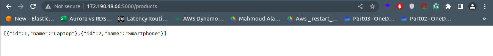

# CodeToLive

Created By: [Aly Ghazal](https://www.linkedin.com/in/aly-ghazal/)

The purpose of this task is to demonstrate my skills in provisioning infra in Azure and create a secure CI/CD pipeline via GitHub actions to deploy a flask app which is in this repo:

[Microservices repository](https://www.linkedin.com/in/aly-ghazal/)

## Infra & Terraform Module Structure


In this project we used Azure as a cloud provider and from the previous image we can conclude that our infrastructure components are:

- **Private Azure Kubernetes Service (AKS) Cluster**: API server not publicly exposed.
- **Dedicated Virtual Network (VNet) with Subnets**: For AKS, Azure Firewall, VM, and ACR private endpoints.
- **Network Security Groups (NSGs)**: Control traffic flow within subnets.
- **Azure Firewall**: Centralized outbound traffic control for AKS and VM. It also facilitates controlled inbound access to internal services via Destination Network Address Translation (DNAT) rules, forwarding external traffic from its public IP to specific internal Load Balancer endpoints within the VNet.
- **Internal Load Balancer**: Automatically provisioned by AKS, this component is responsible for exposing applications deployed within the AKS cluster to internal or DNAT-forwarded external traffic.
- **Azure VM**: Dedicated for running Git Actions pipelines and manage the cluster.
- **Azure Container Registry (ACR)**: Secured with a private endpoint for image storage.

Most of these infrastructure components are provisioned and managed using Terraform, ensuring a declarative, version-controlled, and automated deployment process and this infrastructure is structured using Terraform modules, which significantly enhances maintainability and scalability. Modules encapsulate complex configurations into reusable blocks, allowing for consistent deployment patterns and easy replication of this secure environment across different projects or environments with minimal effort.

and here is the structure of those modules

```text
.
├── main.tf
├── variables.tf
├── outputs.tf  
└── modules/
    ├── AKS&ACR/
    │   ├── main.tf
    │   ├── variable.tf
    │   └── output.tf
    ├── Bastion/
    │   ├── main.tf
    │   ├── variable.tf
    │   └── output.tf
    ├── security (firewall)/
    │   ├── main.tf
    │   ├── variable.tf
    │   └── output.tf
    ├── Networking/
    │   ├── main.tf
    │   ├── variable.tf
    │   └── output.tf
    └── jump_host (vm)/
        ├── main.tf
        ├── variable.tf
        └── output.tf
```

and here are the commands that has provisioned that Infra

```bash
cd Terraform/

#To download necessary providers and needed modules
terraform init

#To review changes and observe expected results without execution
terraform plan

#To deploy the resources in Azure
terraform apply -auto-approve
```

except for the Internal LB which was deployed by the private AKS with credentials of "Network Contributor"

and the only thing was done manually was creating the DNAT rule to forward the external traffic from firewall public ip and a specific port to the internal LB private ip (which is in the same vnet with the firewall) and a specific port


## APP Dockerization

Our Flask application is containerized using Docker, with a Dockerfile that employs multi-stage builds. This approach drastically reduces the final image size and improves security by only including necessary runtime components. Furthermore, our use of Alpine Linux base images ensures our containers are exceptionally light, minimal, and secure. Below, you'll find a visual comparison highlighting the significant image size difference achieved through multi-stage builds.


## VM setup as GitHub action self-hosted runner and to access cluster

In the beginning we need this VM to access other resources (AKS,ACR) since all resources are private and only accessible within the VNet that host all those resources and using GitHub hosted runners won't be efficient since it can't access this infra to push new images in ACR or deploy apps in AKS.
From this need we decided to use a Virual Machine as a self-hosted runner that come with other benefits like having all dependencies installed already and no need to wait for it to be up and running and many other benefits and also we can run multiple pipelines in the same VM so it is also cost efficient
Plus we can use it to access the cluster and debug it.
but How did we setup it?

1. we installed all the needed packages and tools that will be used by GitHub Actions pipeline and to access the cluster like: Git (obviously), Azure-cli, kubectl, docker, python, flake8, trivy.
2. we created a service Principal for the VM to have access on AKS and ACR (you will need to sign in with a privileged account "Owner or Contributor" to create it)

```bash
az ad sp create-for-rbac --name "github-runner-sp" --query "{appId: appId, password: password, tenant: tenant}" --output json
```

after that we give it the needed credintials to access ACR and AKS

```bash
az role assignment create --assignee $SP_APP_ID --role "contributor" --scope $ACR_ID
az role assignment create --assignee $SP_APP_ID --role "contributor" --scope $AKS_ID
```

and then in the VM restore SP credentials in ~/.bashrc (Not recommended at all and it's better to store it in Azure key vault)

```bash
$ vim ~/.bashrc

export SP_APP_ID="xxxxxxxx-xxxx-xxxx-xxxx-xxxxxxxxxxxx"
export SP_PASSWORD="xxxxxxxxxxxxxxxxxxxxxxxxxxxxxxxx"
export SP_TENANT_ID="yyyyyyyy-yyyy-yyyy-yyyy-yyyyyyyyyyyy"

$ source ~/.bashrc
```

then login

```bash
az login --service-principal -u $SP_APP_ID -p $SP_PASSWORD --tenant $SP_TENANT_ID
```

then access ACR

```bash
az acr login --name $ACR_NAME
```

and finally access AKS by getting its credentials (Kubeconfig)

```bash
az aks get-credentials --resource-group $RESOURCE_GROUP_NAME --name $AKS_NAME --overwrite-existing
```

3. Now to setup the VM to be a GitHub self-hosted runner

```bash
# Create a folder (Note: if you will use the same VM for Multiple Pipelines change the folder name for each pipeline)
$ mkdir actions-runner && cd actions-runner

# Download the latest runner package
$ curl -o actions-runner-linux-x64-2.326.0.tar.gz -L https://github.com/actions/runner/releases/download/v2.326.0/actions-runner-linux-x64-2.326.0.tar.gz

# Optional: Validate the hash
$ echo "9c74af9b4352bbc99aecc7353b47bcdfcd1b2a0f6d15af54a99f54a0c14a1de8 actions-runner-linux-x64-2.326.0.tar.gz" | shasum -a 256 -c
# Extract the installer
$ tar xzf ./actions-runner-linux-x64-2.326.0.tar.gz

# Create the runner and start the configuration experience
$ ./config.sh --url $REPO-URL --token xxxxxxxxxxxxxxxxxxxxxxxxxx

# Last step, run it!
$ nohup ./run.sh &
```

and this is how the setup was done

## CI/CD pipeline using GitHub actions

Our project leverages robust Continuous Integration (CI) and Continuous Delivery (CD) pipelines, powered by GitHub Actions. This choice provides several key benefits, including tight integration with our GitHub repositories for seamless workflow automation, a flexible and extensible platform for custom build and deployment steps.

We utilize a separate CI and CD pipeline strategy for this project. This separation further enhances security, clarifies responsibilities, offers greater flexibility, and improves overall scalability and maintainability by isolating build/test processes from deployment.

#### Continuous Integration (CI) Pipeline

Located in the [Microservices repository](https://www.linkedin.com/in/aly-ghazal/), our CI pipeline automatically builds, tests, and prepares the application for deployment upon code pushes or pull requests to main.

Here's how it works:

1. **Checkout Code & Set up Python**: The latest code is retrieved, and a Python 3.9 environment is established.
2. **Run Static Code Analysis (Flake8)**: This critical step employs Flake8, a widely-used Python linter, to enforce code quality and style standards. It executes two distinct checks: a strict error analysis (--select=E9,F63,F7,F82) that reports fundamental issues like syntax errors, unused variables, or undefined names, and a comprehensive style and complexity check (--max-complexity=10 --max-line-length=120) that provides feedback on PEP 8 violations and code complexity. Both Flake8 commands are configured to provide detailed reports on code quality, aiding developers in maintaining a clean and robust codebase.
3. **Build Docker Image**: The application is packaged into a Docker image (microservices-app:4.0) for our Azure Container Registry (akssecureacr.azurecr.io).
4. **Scan Docker Image with Trivy**: The Docker image is scanned for HIGH and CRITICAL vulnerabilities. Any detected vulnerabilities will fail the pipeline.
5. **Push Docker Image to Azure Container Registry (ACR)**: The validated Docker image is pushed to the registry, ready for deployment.

#### Continuous Delivery (CD) Pipeline

Our CD pipeline, in this repository that we are already in, automates deployment to the Kubernetes cluster. It triggers on main branch pushes or can be manually initiated.

Here's its flow:

1. **Checkout Repository**: The repository containing Kubernetes manifests is checked out.
2. **Verify Kubectl Context**: Connectivity to the Kubernetes cluster is confirmed.
3. **Apply Kubernetes Manifests in Order**: Kubernetes configuration files (Namespace, Deployment, Service) are applied sequentially from the Kubernetes/ directory to ensure proper resource creation and update.

## Results

after provisioning our infra and deploy the application you can access it through the following URLs

```text
http://<Public-ip-of-Firewall>:5000/products
&
http://<Public-ip-of-Firewall>:5000/users
```

and here is the final result




## Cleanup

One of the benefits of using terraform or IaC in general is the ability to provision and destroy the entire infra with a single command and in this case we can cleanup the previous infra by using a single command as following

```bash
cd Terraform/

terraform destroy
```

## Future work

- For CD pipeline instead of using GitHub actions it would be more efficient if we used **ArgoCD** not to only deploy application's new versions but also to keep track of the deployed K8s objects by making Git as the single source of truth

- Use **HashiCorp packer** to create a machine image that includes all the needed tools and setup on the VM that is used as GitHub actions self-hosted runner and the needed tools in the pipeline

- finally we need to consider to use **Velero** as a solution for backing up and restoring Kubernetes cluster resources which include simplifying cluster migrations, consistent data snapshots, and ensuring business continuity for your Kubernetes workloads.
